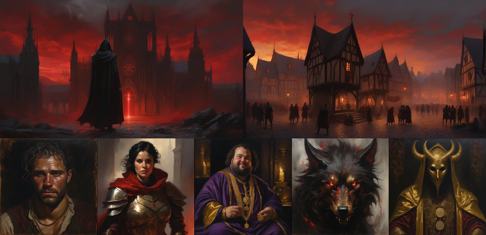

# Etapa 2 — Imagem e Voz (modalidades 2 e 3)

> Data: 2026-09-13 · Máquina: RTX 5060 Ti 8 GB VRAM, 16 GB RAM · tudo **local**, ambiente `F:\ia-local`
> Scripts: `geracao/gerar_imagens.py`, `geracao/gerar_vozes.py`
> Evidência bruta: `assets/manifesto_imagens.json` e `assets/manifesto_audio.json` (prompt, seed, parâmetros e tempo de cada asset)

---

## Modalidade 2 — Imagem

### O que é gerado
Arte de fundo do menu, cenário da tela de gameplay, retratos dos 3 NPCs (Tomás, Capitã Brenna, Odran) e retratos de 2 manifestações (A Fera, O Mercador). Geração **offline**, durante a produção: os PNGs entram prontos no jogo.

### Ferramenta e justificativa
| Item | Escolha |
|---|---|
| Modelo | **Stable Diffusion XL 1.0 base** (`stabilityai/stable-diffusion-xl-base-1.0`), fp16 |
| VAE | `madebyollin/sdxl-vae-fp16-fix` (o VAE original gera imagens pretas/NaN em fp16) |
| Biblioteca | `diffusers` 0.40 + PyTorch 2.11 CUDA 12.8 |
| Custo | Zero por imagem (roda na GPU local) |
| Licença | CreativeML Open RAIL++-M: permite uso comercial, com restrições de uso nocivo |
| Por que não Leonardo/Bing/DALL·E | Exigem conta, têm limite de créditos e termos que mudam. O SDXL local dá reprodutibilidade total: mesmo prompt e mesma seed geram a mesma imagem |
| Parâmetros | 30 passos, guidance 7,0, seed fixa por imagem, `enable_model_cpu_offload()` para caber em 8 GB |

### Prompts usados (exatamente como testados)

Sufixo de estilo comum (`ESTILO`): `dark fantasy, oil painting, dramatic chiaroscuro lighting, highly detailed, muted palette with crimson and gold accents`

Prompt negativo (todas): `text, letters, watermark, logo, signature, blurry, lowres, jpeg artifacts, deformed, bad anatomy, extra fingers, mutated hands, cartoon, anime, 3d render, photo`

| Asset | Tamanho · seed | Prompt (+ ESTILO) | Tempo |
|---|---|---|---|
| `menu_fundo.png` | 1344×768 · 7001 | key art, a lone inquisitor in a tattered black hooded cloak seen from behind, standing before a colossal ruined gothic cathedral at dusk, seven glowing sigils floating in a circle in a blood red sky, ash falling, cinematic wide composition | 35 s* |
| `cena_praca.png` | 1344×768 · 7002 | medieval town square at dusk, wooden gallows and pillory in the center, angry crowd holding torches, burning timber houses, ash in the air, crimson sky, wet cobblestones, wide establishing shot, concept art | 16 s |
| `retrato_tomas.png` | 1024×1024 · 7003 | character portrait, bust shot, gaunt 30 year old male blacksmith, bruised face, hands tied with rope, frightened eyes, ragged soot-stained clothes, torchlight, dark background | 16 s |
| `retrato_brenna.png` | 1024×1024 · 7004 | character portrait, bust shot, stern female guard captain in dented steel plate armor, scar on her chin, short dark hair, hand on sword hilt, furious expression, red cloak, torchlight, dark background | 17 s |
| `retrato_odran.png` | 1024×1024 · 7005 | character portrait, bust shot, fat smiling male merchant with gold rings on every finger, rich purple velvet robes, calculating eyes, holding a golden amulet, candlelight, dark background | 17 s |
| `demonio_fera.png` | 1024×1024 · 7006 | demon portrait, the embodiment of wrath, horned shadowy wolf-like beast with burning red eyes and black veins, smoke and embers, emerging from darkness, terrifying | 17 s |
| `demonio_mercador.png` | 1024×1024 · 7007 | demon portrait, the embodiment of greed, elegant faceless figure wearing a golden mask and robes made of coins, long clawed fingers dripping molten gold, eerie | 17 s |

\* A primeira imagem inclui o aquecimento da GPU.

### Resultado
Arquivos em `assets/imagens/`. Visão geral em `assets/imagens/_folha_de_contato.jpg`:

### Limitações encontradas e contornos
| Limitação observada | Contorno |
|---|---|
| **Elementos do prompt ignorados:** sem os 7 sigilos no céu do menu, sem forca/tochas/fogo na praça, Tomás sem as mãos amarradas, Brenna sem cicatriz | Gerar várias seeds e escolher a melhor; aumentar o peso do elemento (`(gallows:1.4)`); inpainting só na região; ou compor o detalhe no editor (os sigilos podem ser elemento de UI) |
| Prompt precisa ser em inglês (o SDXL entende pouco português) | Manter os prompts em inglês documentados junto com a descrição em português |
| 8 GB de VRAM: SDXL e LLM não cabem juntos na GPU | Imagens são geradas **offline** na produção, nunca durante o jogo; o Ollama é descarregado (`ollama stop`) antes |
| Estilo varia entre imagens (a Fera saiu mais "ilustração", o Mercador mais escuro) | Sufixo de estilo fixo e negativo comum; no MVP, um LoRA de estilo treinado nas melhores imagens |
| Texto dentro da imagem sai ilegível | `text, letters` no negativo; todo texto (título, HUD) é feito na interface, não na imagem |
| Direitos autorais: imagem gerada por IA pode não ter proteção autoral e o modelo foi treinado com obras de terceiros | Não usar nomes de artistas no prompt; declarar o uso de IA nos créditos; revisão humana de cada asset |

---

## Modalidade 3 — Voz

### O que é gerado
Narração da abertura da cena e vozes de NPCs e do Demônio Interior. As falas de Tomás, Odran e A Fera **são as que a LLM gerou de verdade na POC** (ver `prototipo/logs/`). Isso demonstra a cadeia **LLM → TTS** que o jogo usaria em tempo real.

### Ferramenta e justificativa
| Item | Escolha |
|---|---|
| Ferramenta | **Piper TTS 1.8** (ONNX, roda na CPU) |
| Voz | `pt_BR-faber-medium` (rhasspy/piper-voices), voz neural masculina em português do Brasil |
| Custo | Zero, local, sem limite de caracteres |
| Licença | Piper: GPL-3.0 (biblioteca) · voz faber: verificar o *model card* (dataset público) antes de uso comercial |
| Por que não ElevenLabs | Mais natural e expressivo, mas o free tier limita caracteres por mês, exige internet e tem custo por fala em produção. Num jogo com falas geradas ao vivo pela LLM, o custo por caractere é imprevisível |
| Desempenho | ~10 s de áudio em 0,44 s: **mais de 20× mais rápido que o tempo real, na CPU** |

### Textos e parâmetros usados
| Arquivo | Personagem | Texto (exato) | `length_scale` · fator grave | Áudio / geração |
|---|---|---|---|---|
| `narrador_intro.wav` | Narrador | Cinzaforte, cidade tomada pela Ira. Uma multidão furiosa cerca Tomás, acusado de roubar um amuleto de ouro do mercador Odran. A Capitã Brenna quer enforcá-lo agora mesmo. | 1,10 · 0,95 | 9,9 s / 0,44 s |
| `tomas_filha.wav` | Tomás | Minha filha está doente... Precisei comprar remédio urgente. Prometo pagar o Odran de volta assim que conseguir! *(qwen2.5:7b)* | 0,90 · 1,00 | 5,2 s / 0,20 s |
| `odran_preco.wav` | Odran | Hmmm, 20 moedas? Isso não é nem um começo para alguém que tem um futuro brilhante. Que tal 50? *(qwen2.5:7b)* | 1,15 · 0,92 | 7,1 s / 0,27 s |
| `fera_desperta.wav` | A Fera | Sua sede de sangue está apenas começando. Quer saber o preço do poder que eu posso dar? A sua alma, talvez. A Ira não é barata, inquisidor. *(llama3.2:3b)* | 1,25 · 0,78 | 11,0 s / 0,36 s |

`length_scale` > 1 deixa a fala mais lenta. O "fator grave" grava o WAV com taxa de amostragem menor, então o áudio fica mais lento e mais grave.

### Resultado
Arquivos em `assets/audio/` (WAV mono 16 bits). Foi verificado que não há silêncio (RMS 5.200 a 6.500, pico cheio).

### Limitações encontradas e contornos
| Limitação | Contorno |
|---|---|
| **Só existe voz masculina pt_BR no Piper:** a Capitã Brenna não tem voz adequada | Para o MVP: Coqui XTTS-v2 (clona voz a partir de uma amostra curta, tem português) ou ElevenLabs apenas para personagens principais |
| Uma voz para todos: personagens soam parecidos | Variar `length_scale` e taxa de amostragem por personagem (aplicado: A Fera ficou grave e lenta) |
| Entonação neutra, sem emoção (medo, raiva) | A LLM já devolve `emocao`: mapear emoção → velocidade/pausa; no MVP, testar um TTS com controle de estilo |
| Gestos entre asteriscos seriam lidos em voz alta | Removidos por regex antes de sintetizar (aplicado) |
| Truque do "fator grave" soa artificial se exagerado | Usar só na voz sobrenatural (Fera), onde o efeito combina |

---

### v2 da voz (após revisão do grupo)

O grupo avaliou que a Fera da v1 não dava medo e que o Tomás soava apressado e robótico. Mudanças no `geracao/gerar_vozes.py`:
- **Tomás:** síntese frase a frase, com pausa de 0,55 s nas reticências; length 1,02; noise 0,78 (mais entonação); +0,7 semitom; ambiente leve.
- **Fera:** −5,5 semitons, segunda voz desafinada, rosnado por modulação em anel (33 Hz), saturação, passa-baixa de 3 kHz, sussurro limitado à banda de 1,8–5 kHz, reverb de 2,6 s e drone grave.
- **Variantes** em `assets/audio/variantes/`: `fera_v2_abismo` (bem mais grave, reverb de catedral), `fera_v3_sussurro` (rouco, "dentro da cabeça"), `tomas_v2_calmo` e `tomas_v3_nervoso`.
- **Medição:** o manifesto agora registra o centroide espectral e a energia abaixo de 300 Hz e acima de 4 kHz. Na primeira tentativa, o sussurro em ruído branco deixou a Fera com 4,2 kHz de brilho (chiado); corrigido, ela ficou a voz mais escura do conjunto (70 % abaixo de 300 Hz).

## Resumo das 3 modalidades

| Modalidade | Ferramenta | Onde entra | Quando gera | Custo |
|---|---|---|---|---|
| Texto | Ollama + qwen2.5:7b (`llama3.2:3b` alternativo) | Classificação de intenção, fala de NPC, memória, Demônio Interior | **Tempo real**, ~5,5 s/turno | Zero |
| Imagem | Stable Diffusion XL 1.0 + diffusers | Menu, cenário, retratos, manifestações | **Offline** (produção), ~17 s/imagem | Zero |
| Voz | Piper TTS pt_BR-faber-medium | Narração, NPCs, Demônio Interior | Tempo real possível (20× mais rápido que o tempo real) | Zero |
